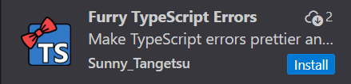

# 安装

## 1．furry-ts-errors（VSCode插件）安装指南

在VSCode插件市场中直接搜索安装 `Furry TypeScript Errors` 即可



## 2．react－furry－error（React 开发环境依赖）安装指南

## 0．项目地址

[react-furry-error](https://github.com/MasaoMinn/react-furry-error "react-furry-error")（可以顺便给我个，感谢）

## 1．安装

使用 npm：

```bash
npm install react-furry-error
```

或使用 pnpm／yarn：

```bash
1 pnpm add react-furry-error
2 # 或
3 yarn add react-furry-error
```

## 2．启用覆盖层

在您的应用程序入口文件中（例如 main．tsx 或 index．tsx）：

```JSX
    import { initFurryDevOverlay} from "react-furry-error";
    if (import.meta.env.MODE === "development") {
        initFurryDevOverlay();
    }
```

如果是Next.js等框架，以上代码不能使用，请使用

```JSX
    import { initFurryDevOverlay } from "react-furry-error";
    if (process.env.NODE_ENV === "development") {
        initFurryDevOverlay();
    }
```

启用后，运行时错误（runtime）将自动触发毛茸茸的错误覆盖层。

## 3．使用 ErrorTest 测试您的环境（可选）

你可以使用 **ErrorTest** 组件来测试 react-furry-error 是否运行正常

```JSX
import { StrictMode } from 'react'
import { createRoot } from 'react-dom/client'
import { initFurryDevOverlay,ErrorTest} from "react-furry-error";

if (import.meta.env.MODE === "development") {
  initFurryDevOverlay();
}

createRoot(document.getElementById('root')).render(
  <StrictMode>
    <ErrorTest />
  </StrictMode>,
)
```
